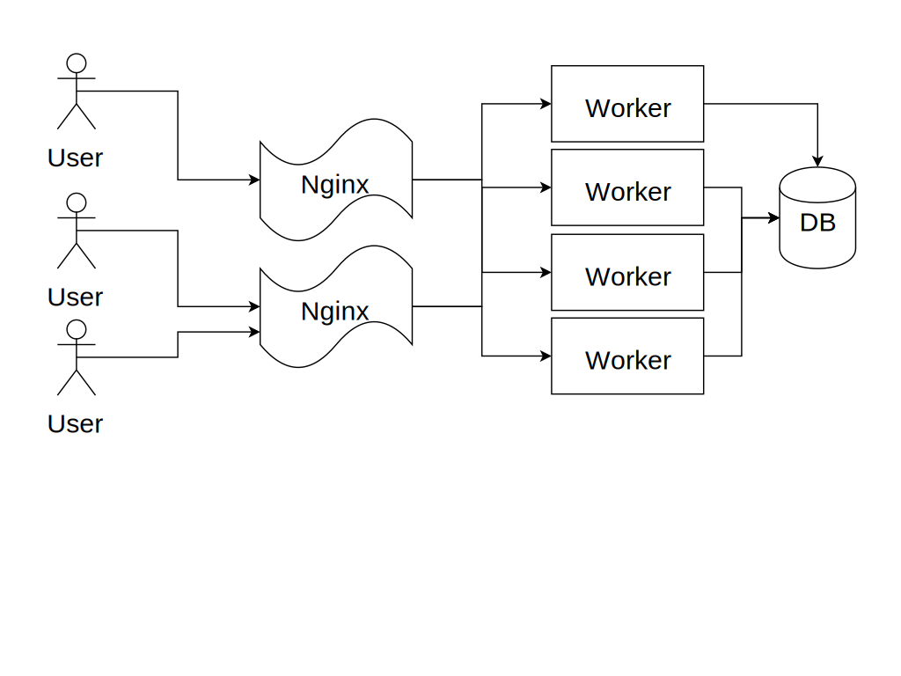
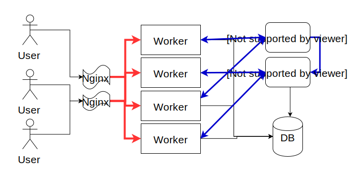
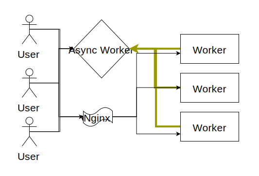
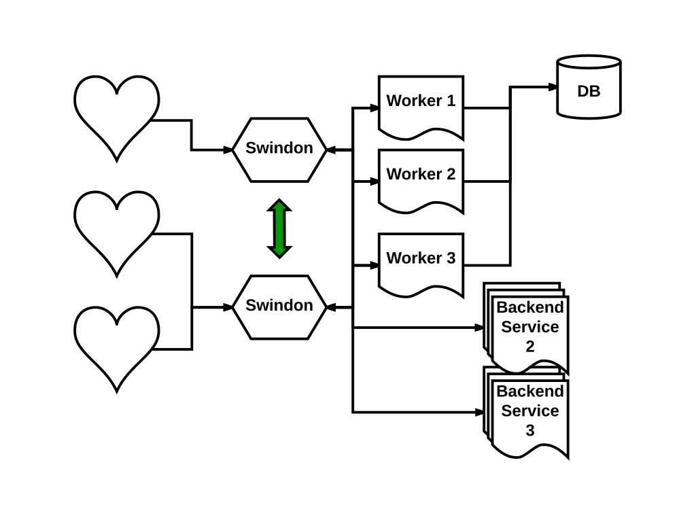
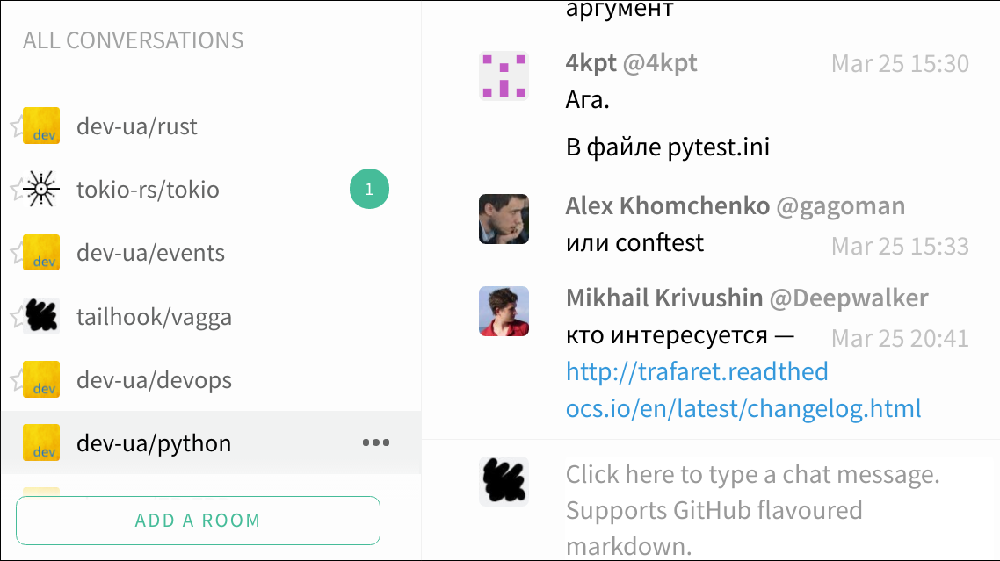

.. title:: Swindon The Web Server
.. meta::
   :author: Paul Colomiets <paul@colomiets.name>

.. role:: fragment
   :class: fragment

.. role:: strike
   :class: strike

Modern Websocket Gateway Server
===============================

Problems Websockets Solve
=========================

* :fragment:`Real-Time Push Notifications`
* :fragment:`Chats`
* :fragment:`Games`
* :fragment:`Remote Procedure Calls (RPC)`

Classic Web Model
=================

Adding WS 1
===================

Adding WS 2
===================

Consequences
============

* :fragment:`Message loss`
* :fragment:`Scaling/failover issues`
* :fragment:`Software upgrade issues`
* :fragment:`Custom routing`

Introducing Swindon
===================

A modern HTTP edge server

with smart websocket support

Swindon
=======

* :fragment:`A (reverse) proxy`
* :fragment:`Serves files (just in case)`
* :fragment:`Websockets`

Swindon
=======

Reminder: WS 1
==============

Swindon
=======

Reminder: WS 2
===================

Key Points
==========

* Routing
* Replication
* Data Model
* Software Updates (*)

Websocket Proto
===============

* RPC
* Pub-Sub
* Lattice

RPC
===

* :fragment:`user1 → ☂: call chat.send_message(x)`
* :fragment:`☂ → backend1: chat.send_message("user1", x)`
* :fragment:`backend1 → ☂: return "ok"`
* :fragment:`☂ → user1: return "ok"`

Routing
=======

* chat.* → chat{1,2,3}
* pizza.* → pizza{1,2}

RPC Features
============

* Prefix Routing
* Sticky Auth

Pub-Sub
=======

* :fragment:`user1 → backend: I want room "kittens"`
* :fragment:`backend → ☂: subscribe(user1, @rooms.kittens)`
* :fragment:`user1 → backend: Send "hello"`
* :fragment:`backend → ☂: send(@rooms.kittens, "user1: hello")`

Swindon vs WAMP
===============

* WAMP: subscription from client
* Swindon ☂: subscription from backend

(*) Web Application Messaging Protocol

Pub-Sub
=======

* Authorization
* First time sync

Lattice
=======

The Task
========

Components
==========

* Room List

  * Unread Messages

* Chat History

Issues
======

* Multiple tabs/devices
* Eventual consistentcy
* Lost/duplicate messages

Eventual Consistency
====================

* user1 -> messages read
* user2 -> new message

Eventual Consistency
====================

* user1 -> -1 unread
* user2 -> +1 message

:strike:`Pub-Sub`
=================

Consistency 2
=============

* device1 -> get_rooms
* device2 -> add_room

Consistency 3
=============

* device1 -> get_rooms
* user2 -> new mesage
* device2 -> add_room
* user3 -> new mesage

CRDT
====

Commutative Replicated Data Types

CRDT
====

Solves eventual consistency problem

CRDT
====

* Counter/Max

[[ schematic ]]

Unread Messages
===============

* Messages [counter]
* Last Read [counter]

Lattice
=======

[[ table ]]

Lattice
=======

* Auto-updates room list
* Conflict-free eventual consistency

Simple to Run
=============

::

    swindon-dev ./public /api/=http://localhost:8111

Q & A
=====

::

    cargo install swindon
