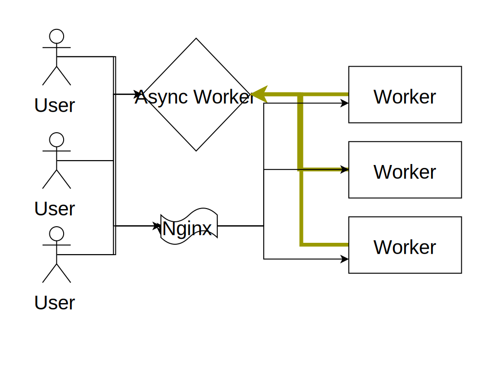

.. title:: Swindon The Web Server
.. meta::
   :author: Paul Colomiets <paul@colomiets.name>

.. role:: fragment
   :class: fragment

Modern Websocket Gateway Server
===============================

Problems Websockets Solve
=========================

* :fragment:`Real-Time Push Notifications`
* :fragment:`Chats`
* :fragment:`Games`
* :fragment:`Remote Procedure Calls (RPC)`

Classic Web Model
=================

.. image:: classic-web.svg

Adding WS 1
===================

.. image:: websockets-pubsub.svg

Adding WS 2
===================

Consequences
============

* :fragment:`Message loss`
* :fragment:`Scaling/failover issues`
* :fragment:`Software upgrade issues`
* :fragment:`Custom routing`

Introducing Swindon
===================

A modern HTTP edge server with smart websocket support

Swindon
=======

* A (Reverse) proxy
* Serves files
* Websockets

