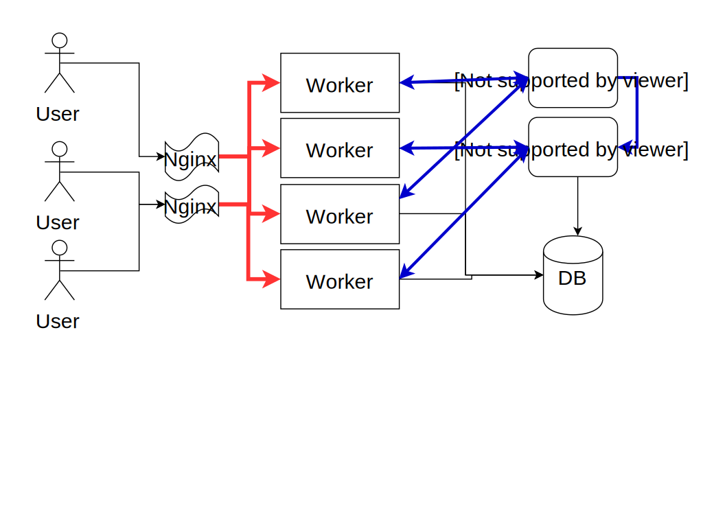

.. title:: Swindon The Web Server
.. meta::
   :author: Paul Colomiets <paul@colomiets.name>

.. role:: fragment
   :class: fragment

.. role:: bold-fragment
   :class: fragment bold

.. role:: strike
   :class: strike

Modern Websocket Gateway Server
===============================

Problems
========

* :fragment:`Real-Time Push Notifications`
* :fragment:`Chats`
* :fragment:`Games`
* :fragment:`Remote Procedure Calls (RPC)`

Classic Web
===========

Adding WS 1
===================

Adding WS 2
===================

.. image:: websockets-single.svg

Cons.
=====

* :fragment:`Message loss`
* :fragment:`Scaling/failover issues`
* :fragment:`Software upgrade issues`
* :fragment:`Custom routing`

Introducing Swindon
===================

A modern HTTP edge server

with smart websocket support

Swindon
=======

* :fragment:`A (reverse) proxy`
* :fragment:`Serves files (just in case)`
* :fragment:`Websockets`

.. class:: no-title

Basic Picture
=============

Recall: WS 1
==============

.. class:: no-title

Basic Picture Again
===================

Recall: WS 2
===================

.. image:: websockets-single.svg

Key Points
==========

* Routing
* Replication
* Data Model
* Software Updates (*)

WS Proto
========

* RPC
* Pub-Sub
* Lattice

.. class:: smaller-font-2

RPC
===

* :fragment:`user1 → ☂: call chat.send_message(x)`
* :fragment:`☂ → backend1: chat.send_message("user1", x)`
* :fragment:`backend1 → ☂: return "ok"`
* :fragment:`☂ → user1: return "ok"`

Routing
=======

* chat.* → chat{1,2,3}
* pizza.* → pizza{1,2}

RPC Features
============

* Prefix Routing
* Sticky Auth

.. class:: smaller-font-2

Pub-Sub
=======

* :fragment:`user1 → backend: I want room "kittens"`
* :fragment:`backend → ☂: subscribe(user1, @rooms.kittens)`
* :fragment:`user1 → backend: Send "hello"`
* :fragment:`backend → ☂: send(@rooms.kittens, "user1: hello")`

☂ vs WAMP
=========

* WAMP: subscription from client
* Swindon ☂: subscription from backend

(*) Web Application Messaging Protocol

Pub-Sub
=======

* Authorization
* First time sync

Lattice
=======

The Task
========

Components
==========

* Room List

  * Unread Messages

* Chat History

Issues
======

* Multiple tabs/devices
* Eventual consistentcy
* Lost/duplicate messages

Eventual Consistency
====================

* user1 -> messages read
* user2 -> new message

Eventual Consistency
====================

* user1 -> -1 unread
* user2 -> +1 message

:strike:`Pub-Sub`
=================

Consistency2
=============

* device1 -> get_rooms
* device2 -> add_room

Consistency3
=============

* device1 -> get_rooms
* user2 -> new mesage
* device2 -> add_room
* user3 -> new mesage

CRDT
====

Commutative Replicated Data Types

CRDT
====

Solves eventual consistency problem

CRDT
====

* Counter/Max

Counters
========

* :fragment:`Game: Experience`
* :fragment:`Chat: Last Message Id`
* :bold-fragment:`Metadata Version`

CRDT: Money
===========

Two ever growing counters:

* Earned Money
* Spent Money

Unread Messages
===============

* Total Messages
* Last Read No.

Lattice
=======

.. class:: no-title

Lattice Birdview
================

.. class:: no-title

Lattice CRDT
============

.. class:: no-title

Lattice Values
==============

Lattice
=======

* Auto-updates room list
* Conflict-free eventual consistency

Simple to Run
=============

::

    swindon-dev ./public /api/=http://localhost:8111

Q & A
=====

::

    cargo install swindon
